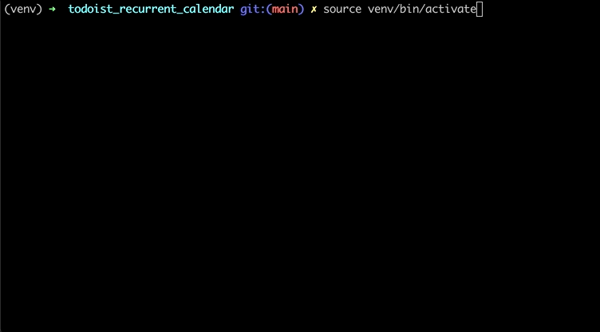

# Todoist recurring tasks creation for calendar

[Todoist](https://todoist.com/) is a productivity app that helps people to organize work and life. One of the coolest feature is the recurring tasks, i.e. tasks that repeat themselves on a regular basis.

From the [docs](https://todoist.com/help/articles/set-a-recurring-due-date):

> Instead of creating a new task for each occurrence, give it a recurring due date! When you complete a recurring task, it will automatically reset for the next due date with no extra effort required on your part.

If you use the calender to plan and keep track of your activities, there is one major limitation in using this recurring tasks. As stated in the official [FAQ](https://todoist.com/help/articles/set-a-recurring-due-date):

> After I set a recurring task, I can only see the first task and not the rest. How can I see all recurrences of the tasks in Todoist?
> It’s not possible to see all upcoming recurrences of a task in Todoist. This is because a recurring task is a single task with a shifting due date, rather than multiple separate tasks.

In other words, reccuring tasks don't appear at their next due date until they are completed. As a work-around, one can set a weekly recurring task for each day, creating multiple instances of the same recurring task for each week day of occurence.

The purpose of this small project is to automate the creation of such repeated instances of the same recurring task.

## Prerequisites

Tested with:

- Docker: 20.10.13
- Python: 3.9.4

## How to build

```bash
docker build -t todoist_recurring_tasks .
```

## How to run

### With Docker

```bash
# Run
docker run --name todoist-recurring-tasks -e TOKEN MY_SECRET_TOKEN -i todoist_recurring_tasks

# To restart
docker start -ai todoist-recurring-tasks
```

### Without Docker

#### Setup venv

```bash
python3 -m venv venv/
source venv/bin/activate
pip install --upgrade pip
pip install -r requirements.txt
```

#### Run

```bash
source venv/bin/activate
python app.py
```

## Demo



## Contributing

Pull requests are welcome. For major changes, please open an issue first to discuss what you would like to change.

## License

[Apache License 2.0](https://choosealicense.com/licenses/apache-2.0/)
